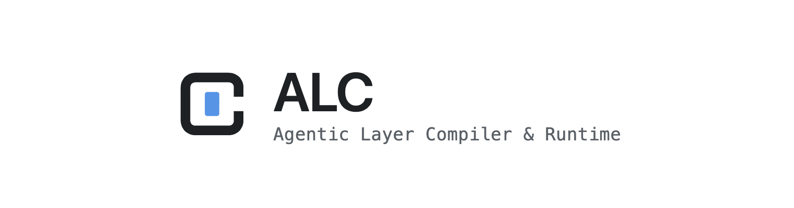

<div align="center">

<picture>
  <source media="(prefers-color-scheme: dark)" srcset="assets/logo-dark.png">
  <source media="(prefers-color-scheme: light)" srcset="assets/logo-light.png">
  
</picture>

# ALC — Agentic Layer Compiler & Runtime

**Declare how your agents should work once. Run it on any coding engine — with the guardrails built in.**


**English** | [Português](README.pt-BR.md)

</div>

---

ALC is a **control plane for agentic coding**. It keeps the good practices — verification, focus, isolation, review — *outside* the model, in plain deterministic code. The coding engine (Claude Code, Gemini, …) becomes a thin, swappable executor.

The point: best practices stop being discipline you have to remember, and become defaults you can't skip.

## ✨ Highlights

- 🛡️ **Guarantees outside the model** — the Assurance Loop runs your checks and repairs until they pass. Nothing is reported done until it actually is.
- 🔌 **Engine-agnostic** — Claude Code or Gemini. Switch with a flag; the control plane doesn't change.
- 🎯 **One agent, one purpose** — every task is a focused Single Mandate. No context pollution.
- 🧩 **Composable** — Blueprints → Flows → a Conductor that turns a goal into the right Flows.
- 🌙 **Unattended** — drop tasks in a queue; cron's `alc tick` drains them, isolated, while you're away.
- 🧠 **Specialists** — agents that keep a Knowledge File and get better at an area over time.
- 🔒 **Isolated** — `--isolate` runs the work in a throwaway git-worktree branch, so your working tree stays clean.

## 🚀 Quick Start

> New to ALC? The [first-run guide](https://alc-runtime.vercel.app/docs/getting-started/first-run) walks you from install to a verified change, with the rough edges flagged.
>
> If you set up with `uv sync`, prefix the commands below with `uv run` (e.g. `uv run alc lint`).

**Install** — one command, and the same one updates you later.

macOS and Linux:

```bash
curl -fsSL https://alc-runtime.vercel.app/install.sh | sh
```

Windows (PowerShell):

```powershell
irm https://alc-runtime.vercel.app/install.ps1 | iex
```

It installs [uv](https://docs.astral.sh/uv/) if you do not have it, installs
`alc-runtime[ui]`, and puts the command on your PATH — the step people otherwise
hit. Read it first if you would rather:
[install.sh](https://alc-runtime.vercel.app/install.sh) ·
[install.ps1](https://alc-runtime.vercel.app/install.ps1).

<details>
<summary>Prefer to do it by hand?</summary>

```bash
uv tool install alc-runtime          # installs the `alc` command
uv tool install "alc-runtime[ui]"    # …with the web UI (dashboard, live runs)
```

`uv tool install` puts the binary in `~/.local/bin`. If `alc --version` says
"command not found", that directory is not on your PATH — which is exactly what
the script above handles for you.

</details>

> The PyPI package is **`alc-runtime`**; it puts the **`alc`** command on your PATH.
>
> Hacking on ALC itself? `uv sync` in a clone and prefix commands with `uv run`.

**Set up a project** — three steps from zero to a validated Operator Layer:

```bash
cd your-project
alc init --setup     # 1. scaffold .alc/ (detects your stack) + install the editor skill
alc onboard          # 2. adopt the checks your project ALREADY declares (Makefile targets,
                     #    package.json scripts) — proposes first, you approve
alc lint             # 3. validate the Operator Layer
```

**Run**

```bash
# Safe by default: the scaffolded manifest uses the free Mock engine (no model calls).
alc run chore "remove the unused export endpoint"

# Use a real engine when you're ready:
alc run chore "tidy the imports"        --engine claude-code
alc run chore "tidy the imports"        --engine claude-code --tier standard
alc flow ship "add a changelog entry"   --engine claude-code --isolate
alc conduct "the README is stale, refresh the docs" --engine claude-code --parallel
alc primer new my-context               # scaffold a Primer at .alc/primers/my-context.md
alc tick --concurrency 4                # drain the queue 4 tasks at a time
```

## 🧭 Commands

**By intent** — the fast path when you already know what you want:

| Intent | Reach for |
|---|---|
| **Discover** this project | `alc status` · `alc lint` · `alc team status` · `alc audit` |
| **Run** one verified unit | `alc run <blueprint> "…"` · `alc spike "…"` · `alc flow <flow> "…"` |
| **From a goal**, let ALC plan | `alc conduct "<goal>"` |
| **Explore** alternatives | `alc explore … --variants N` → `alc compare --diff` → `alc adopt` |
| **Run unattended** | `alc enqueue …` → `alc tick` · `alc loop --once` / `alc loop` |
| **Integrate** the result | `alc land` · `alc discard` |

<details>
<summary><strong>Full command reference</strong> (click to expand)</summary>

| Command | What it does |
|---|---|
| `alc init [--setup]` | Scaffold a default `.alc/` Operator Layer; detects your stack and writes real checks (and installs the editor skill) |
| `alc onboard [--yes] [--stage NAME]` | Adopt the checks your project ALREADY declares (Makefile targets, `package.json` scripts) into a `project` check_set and wire them into your Blueprints — proposes first, applies on approval (`--yes` skips the prompt); `--stage` also records the product stage |
| `alc lint` | Validate the Operator Layer (your `.alc/`, not your source code) against the Policy Gate |
| `alc run <blueprint> "<task>"` | Run one Blueprint as a verified Single Mandate; `--tier NAME` overrides the compute tier for this invocation |
| `alc spike "<task>"` | Sugar over the Prototyper's `spike` Blueprint (`mode: spike`) — a fenced exception to the checks gate: forced isolation, zero repairs, no commit/auto-merge, excluded from the Scorecard streak |
| `alc flow <flow> "<task>"` | Run a multi-stage pipeline (e.g. plan → build); `--tier NAME` applies to every stage; verify-only stages act as pure check gates (checks only, no engine turn) |
| `alc conduct "<goal>" [--parallel]` | Let ALC pick which Flow(s) to run; `--parallel` dispatches independent units concurrently in isolated worktrees; `--enqueue` to queue instead |
| `alc specialist <name> "<task>"` | Run an area Specialist (Recall → Act → Learn) |
| `alc tick [--concurrency N]` | Drain the task queue — call this from cron; `--concurrency N` processes up to N isolated tasks in parallel |
| `alc enqueue <name> "<task>"` | Write a queue task directly, no planner turn; `--kind flow\|specialist`, `--touches` auto-serializes overlapping edits, `--from-file` batches many at once |
| `alc land [branch...] [--all] [--push\|--pr]` | Integrate `alc/*` demand branches into the current branch (linear cherry-pick); no arguments lists the unmerged ones; `--push` pushes the current branch to the delivery remote afterward, `--pr` also opens a pull request via `gh` — a push/PR failure never fails the land |
| `alc discard [branch...] [--all-unmerged]` | Force-delete `alc/*` branches, prune stale worktrees (`--worktrees`), or remove old bundles (`--bundles --older-than N`) — always asks for confirmation |
| `alc explore <blueprint> "<task>" --variants N` | Run N variants of the same unit in isolated worktrees (optional `--engine`/`--tier` cartesian product); never auto-merges — prints a per-variant table (branch, checks, scorecard, cost, diffstat) |
| `alc compare <branch\|stem>...` | Put explored variants side by side — the same columns `explore` prints |
| `alc adopt <branch>` | Integrate the chosen variant and discard the other losing `alc/variant-*` branches — always asks for confirmation |
| `alc primer new <name>` | Scaffold a new Primer file at `.alc/primers/<name>.md` |
| `alc new <kind> <name>` | Scaffold a new blueprint/flow/specialist/loop/primer from a core template; `--from NAME` clones an existing unit |
| `alc status [--json]` | One-shot health snapshot for monitoring: pending tasks, outstanding failures, loop states, unmerged branches — always exits 0 |
| `alc runs list\|show\|tail` | Inspect run logs (`.alc/runs/*.jsonl`): list recent runs, show one in full, or tail its last N events |
| `alc audit --since 7d` | Aggregate the archived queue reports over a trailing window: task counts, Scorecard totals/averages, changed files, and engine usage/cost |
| `alc metrics [--check NAME] [--json]` | Show the metric-check time series recorded in the project's ledger: value, delta vs the previous measurement, and trend — read-only, populated by `metric` checks (`alc run`/`alc flow`/`alc tick`/…) |
| `alc team hire\|list\|retire\|remove\|status` | Scaffold, roster, retire, or remove an Archetype Pack — the five are `prototyper`, `builder`, `sweeper`, `grower`, `maintainer`. Hiring is ADDITIVE (writes only the pack's missing files; `--force` overwrites). `alc init --stage pre-pmf\|growth\|strong-pmf` installs that stage's combo; `status` also shows Mix Health when `stage` is declared |
| `alc checks audit [--json]` | Re-detect your stack(s) and PROPOSE check_set upgrades against the Manifest — never writes; flags checks still commented out for a missing binary |
| `alc signal ingest --kind K --source S --title T` | Ingest a typed real-usage signal (`error`\|`feedback`\|`issue`\|`review`); `--from-file PATH` accepts an already-formed JSON payload; `alc signal list [--json]` shows what's pending consumption by a `signals` replenish loop |
| `alc serve --webhook [--host H] [--port P] [--token T]` | A minimal HTTP door onto signal intake and the enqueue path — `POST /signal`, `POST /enqueue`, `GET /health`; validates and writes only, never executes; `alc tick`/`alc loop --once` drains what lands |
| `alc artifacts [<stem>] [--json]` | List a run's captured e2e evidence (screenshots, curled responses, the health-poll log) — proof a `needs_service` run's `capture:` command actually verified the app live; defaults to the most recent run with artifacts |
| `alc schedule install\|list\|remove <tick\|cycle NAME> --every 15m` | Generate and manage the crontab entry (or print the line to paste when no `crontab` is available) that fires `alc tick`/`alc loop NAME --once` on a cadence — idempotent install, marker-scoped remove |
| `alc setup [--engine]` | Install/update the user-level editor skill (Claude Code or Gemini) |
| `alc ui [--lan] [--port 8642]` | Serve the web IDE (dashboard, queue, live runs, loops, config) — needs the optional `ui` extra |

Add `--engine claude-code|gemini|mock` to choose the executor, and `--isolate` to contain edits to a git-worktree branch.

Blueprints support `max_repairs` to cap the Assurance Loop repair budget, and `check_set` to reference a reusable named check set declared in the Manifest. Checks run by exit code without a shell by default; add a `shell:` one-liner to a check entry to run it via `sh -c` (note: pass/fail is decided solely by the exit code — stdout/stderr are captured and fed to the repair directive, but they do not affect the pass/fail decision).

</details>

## 🖥 Web UI

`alc ui` serves a local, single-user web IDE — an IntelliJ-like control room for every
registered project: dashboard, queue, live runs (Assurance Loop timeline), loops and config,
all updated in real time over WebSocket (no refresh, ever).

```bash
uv tool install "alc-runtime[ui]"   # or: uv sync --extra ui
alc ui                              # http://127.0.0.1:8642 — frontend served by default
alc ui --lan                        # binds every interface, prints the address for other devices
```

The frontend lives in [`ui/`](ui/) (React + Vite + TypeScript). Development workflow:

```bash
cd ui && npm install
npm run dev        # Vite dev server proxying /api and /ws to 127.0.0.1:8642
npm run build:alc  # publish the production build into src/alc/ui/static/ (gitignored; shipped in the wheel)
```

`--lan` prints a **Network:** line with the address to type on any other device on your network
(another laptop, a desktop, a tablet, a phone) — pair it with
`--token T` on any network you do not control. `--ui-dist PATH` serves an alternative build;
`--no-ui` serves only the API/WebSocket.

## 🧱 How it fits together

ALC lives in a ring around your codebase — the **Operator Layer** (`.alc/`), kept separate from your app code:

- **Blueprint** — a template for a class of work (chore, bug, feature…), carrying its own checks and report.
- **Flow** — Blueprints composed into a pipeline; each stage is its own mandate, threading context forward.
- **Conductor** — turns a high-level goal into the right Flows, then runs or queues them.
- **Specialist** — an agent with a Knowledge File for one area, improving as it works.
- **Assurance Loop** — `Act → Verify → Repair`. Your checks are the law.
- **Scorecard** — tracks Span / Passes / Streak / Touch, heading toward hands-off delivery.

## 🪜 Where you are on the ladder

ALC grows with you: **Attended** (you run it) → **Detached** (it runs unattended off the queue) → **Conducted** (a Conductor drives the Flows for you). You don't start at the top — you climb.

## 📚 Documentation

**[alc-runtime.vercel.app](https://alc-runtime.vercel.app)** — the full documentation site: getting started,
concepts, guides, and the CLI reference.

- [Concepts & vocabulary](docs/concepts.md) — the words ALC uses, and the two-plane model
- [Architecture](docs/architecture.md) — the control-plane / execution-plane diagram
- [Engine contract](docs/engine-contract.md) — what it takes to plug in an engine
- [MVP & roadmap](docs/mvp.md)

## 🧪 Status

Experimental, but real: every feature is covered by a hermetic test suite and validated live against Claude Code and Gemini. Python 3.12 + uv, no heavy dependencies.

## 📄 License

[MIT](LICENSE) © gifflet
